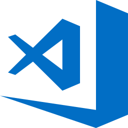
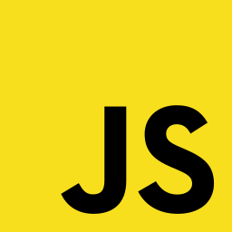
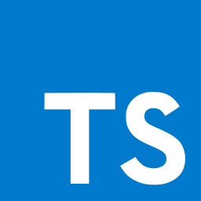
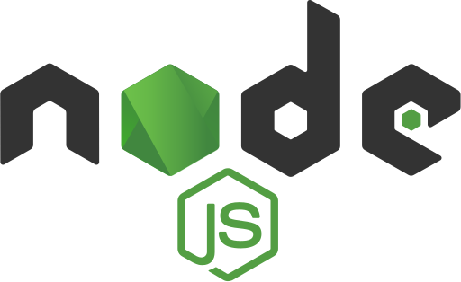
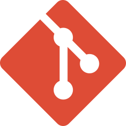
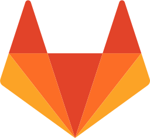
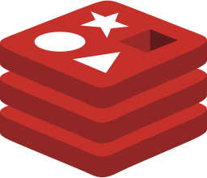
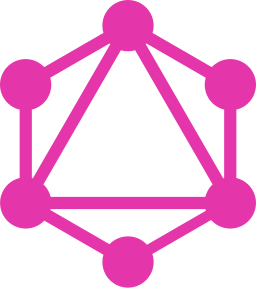

### Welcome to my github!

## I`m Felipe, an enthusiastic full stack developer!

- 🚀 Always learning something new
- 🎾 Big Tennis fan!

### Networks:

### Currently working with:

### Interests:

